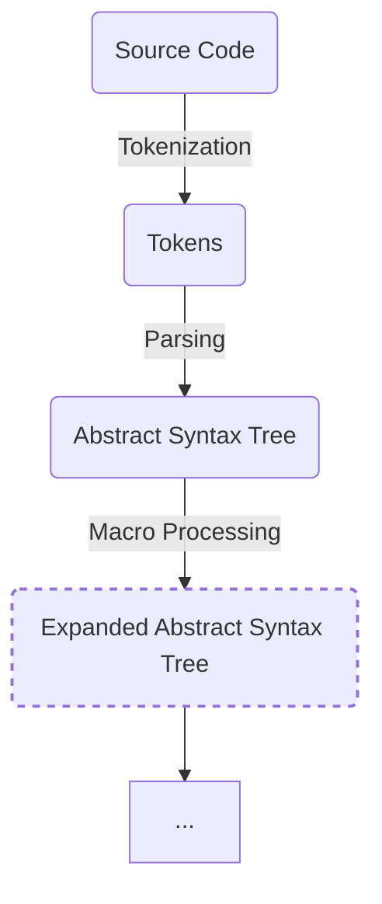

Procedural macros are Rust functions that take a token stream (or two) as parameters and generate a token stream in return.
The purpose of these macros in Rust is to extend the language's syntax while adhering to specific rules.
A crucial rule is that macros must accept and produce a valid Rust syntax tree.
This rule becomes apparent when considering the stage at which macro expansion occurs in the compilation process:



As illustrated, macro expansion takes place after the abstract syntax tree (AST) is constructed.
Consequently, in order to build the AST and expand the macro, the source code must adhere to valid Rust syntax.
Due to the absence of type checking at this stage, it becomes evident why certain information, such as the implemented traits for a struct, are unavailable.

A procedural macro can either panic, return a token stream, or loop endlessly. The returned token stream will either replace the input token stream, or
gets appended to it depending on the type of the procedural macro. If the macro panics, its message will be shown as a compiler error message. 
Endlessly looping causes the compiler to hang.

> Beware that since procedural macros are ran during the compilation process, they have the same privileges that the compiler has. This includes access to the files to which
the compiler has access to.
{: .prompt-warning }

## Spans
Spans describe a region of source code. All tokens in a token stream have an associated span. Spans are crucial for diagnostics and reporting errors.
For example, in the snippet below:

```console
 --> src/main.rs:2:60
  |
1 | fn main() {
  |    ---- this is not async
2 |     let result = async { /* Do something async in main */ }.await;
  |                                                            ^^^^^^ only allowed inside async functions and blocks
3 | }
```
The `^^^^^` symbol under `.await` and `----` under `main` annotate regions of code that are described by spans.
By using spans we can highlight part of a token stream and show helpful messages as to why our macro is failing.

## Hygiene
Hygiene describes the ability of a macro to operate within its own context without interfering with its environment. 
To understand this consider the snippet below:
```rust
macro_rules! plus_one {
    ($e: expr) => {{
        let new_ident = 0;
        $e
    }};
}

fn main() {
    let one = plus_one!(new_ident + 1);
}
```

Line `9` gets expanded to:

```rust
let one = {
    let new_ident = 0;
    new_ident + 1
};
```

Which by itself is a valid Rust code, but causes the following compiler error:

```console
error[E0425]: cannot find value `new_ident` in this scope
 --> src/main.rs:9:25
  |
9 |     let one = plus_one!(new_ident + 1);
  |                         ^^^^^^^^^ not found in this scope
```

The problem is with the (invisible) syntax context that is attached to `new_ident`. Let's annotate this syntax context and make it visible:
```rust
macro_rules! plus_one {     // +
    ($e: expr) => {{        // +
        let new_ident = 0;  // +
        $e                  // +
    }};                     // +
}                           // +

let one = {                 // +
    let new_ident = 0;      // -
    new_ident + 1           // +
};                          // +
```
As you can see line `9` is the the line that holds the identifier generated by the macro expansion, and hence is in another syntax context than other lines. 
So, `new_ident` in line `9` is in another syntax context than `new_ident` in line `10`. Therefore the compiler says `new_ident` cannot be found in this scope.

> For two identifiers to be the same, their names *and* syntax contexts must be the same.
{: .prompt-info}

The root of the problem with our implementation of the `plus_one!` macro is that `new_ident + 1` and `new_ident` have different syntax contexts since one
is inside the macro and the other is outside of the macro.
We can pass both `new_ident` and `new_ident + 1` to the macro to force a common syntax context:
```rust
macro_rules! plus_one {
    ($ident: ident, $expr: expr) => {{
        let $ident = 0;

        $expr
    }};
}

fn main() {
    let one = plus_one!(new_ident, new_ident + 1);

    println!("{one}");
}
```
The code compiles and prints `1`.

Now that we've understood the concept of hygiene in Rust, let's define it formally:

There are 3 types of hygiene:
  Definition Site (hygienic)
  : Items that have a definition site span, cannot access and cannot be accessed by anything outside of the invocation site.

  Call Site (unhygienic)
  : Items that have a call site span, act like they are written inline to the code they're next to. 
  This means that they're affected by external items and also affect external items.

  Mixed Site
  : Items with this type of span may resolve to definition site or call site depending on the type of the item.

> Procedural macros are unhygienic.
{: .prompt-info}

## Types of Procedural Macros
#### **Custom Derive Macros**
Derive macros define new implementations for the derive attribute. These macros can create new items given the token stream of a struct, enum, or union.
Note that the output token stream of a derive macro gets appended to its input token stream. One good example (if I may &#128539;) is
[`tidy_builder`](https://github.com/maminrayej/tidy-builder) which we're going to implement a simple version of. And, one of the most famous examples is `Clone`.

An empty derive macro named `MyDerive` looks like this:
```rust
use proc_macro::TokenStream;

#[proc_macro_derive(MyDerive)]
pub fn my_derive(item: TokenStream) -> TokenStream {
    todo!()
}
```

Then you would use this macro like this:
```rust
#[derive(MyDerive)]
pub struct MyStruct;
```

#### **Function-like Macros**
A function-like procedural macro, as its name implies, transforms an input token stream into another token stream. One good usecase for these macros is to
transform a DSL(Domain Specific Language) to Rust code.

An empty function macro named `my_function` looks like this:
```rust
use proc_macro::TokenStream;

#[proc_macro]
pub fn my_function(input: TokenStream) -> TokenStream {
    todo!()
}
```

Then you would use this macro like this:
```rust
my_function!(h1 { "My cool header" })
```

A good example is the `slint!` macro of the [`slint`](https://slint.dev) project:
```rust
fn main() {
    MainWindow::new().unwrap().run().unwrap();
}

slint::slint! {
    export component MainWindow inherits Window {
        Text {
            text: "hello world";
            color: green;
        }
    }
}
```

#### **Attribute Macros**
Attribute macros define new *outer* attributes which can be attached to items. This type of macro gets two token streams as input.
The first parameter is the token tree following the attribute's name, and the second token stream is the item the attribute is attached to 
without the attribute this proc macro defines.

An empty attribute macro named `my_attribute` looks like this:
```rust
use proc_macro::TokenStream;

#[proc_macro_attribute]
pub fn my_attribute(input: TokenStream, item: TokenStream) -> TokenStream {
    todo!()
}
```

Then you would use this macro like this:
```rust
// `input` ---------.
//                  |
//                  v
//                ----
   #[my_attribute(cool)]
   pub struct MyStruct;
// --------------------
//            ^
//            |
// `item` ----'
```

Good examples of this type of macro are `test` and `cfg` macros:
```rust
#[cfg(test)]
mod tests {
    #[test]
    fn my_test() { 
        assert_eq!(1 + 1, 2);
    }
}
```

## Conclusion
With basics covered, we are ready to move on to the next post where we setup a project suitable for writing a derive macro, and
start to implement our simple version of the `tidy-builder` crate.
   
## Additional Resources
[The Little Book of Rust Macros](https://veykril.github.io/tlborm/introduction.html)  
[The Rust Reference](https://doc.rust-lang.org/stable/reference/procedural-macros.html)


   
