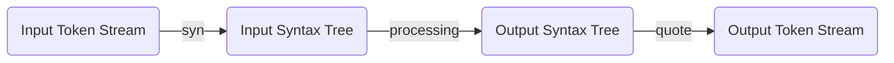
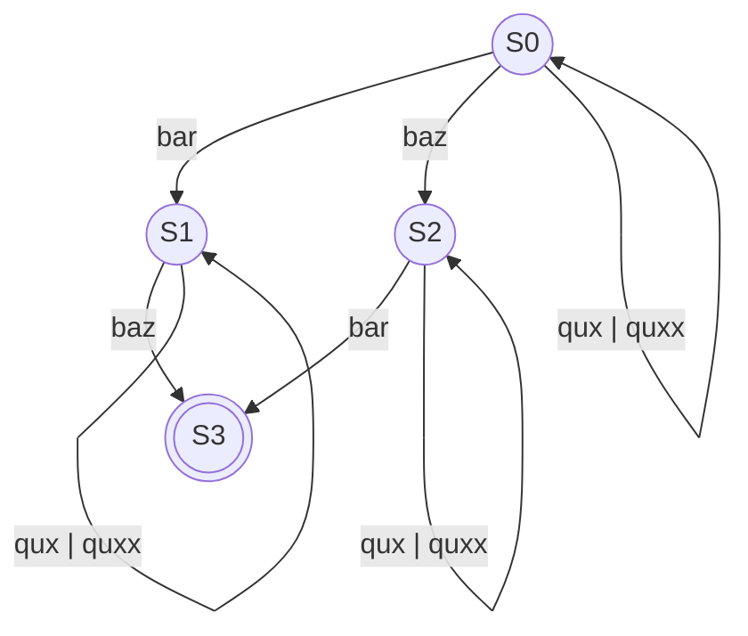

## Setup
Let's create our project:
```console
cargo new --lib tiny-builder
```
To indicate to the compiler that our project is going to be a procedural macro, we need to add the `lib.proc-macro` key to
the `Cargo.toml` file:
```toml
[lib]
proc-macro = true
```
Next, wee need essential dependencies to effectively work with token streams:
```console
cargo add syn quote
```
 We also need some additional features from the `syn` crate that are not enabled by default. To achieve this edit the `Cargo.toml` file:
```toml
syn = { version = "2.0.27", features = ["full", "extra-traits"] }
```
{: file="Cargo.toml"}

The syn library is used for parsing a stream of Rust tokens into a syntax tree of Rust source code, while quote is used for turning 
Rust syntax tree data structures back into a token stream.

Working with syntax trees is much more convenient than handling token streams. However, procedural macros receive token stream(s) as 
input and are expected to return a token stream as a result. It would be great if we could work with syntax trees and when we're done, 
convert it all to a token stream and return the result. Well the combination of `syn` and `quote` helps us to achieve excatly that:


Another important tool when we're writting procedural macros is `cargo-expand` which helps us by expanding our macro and
printing it to the terminal. This will prove essential to our work when debugging our macro. To install it run:
```console
cargo install cargo-expand
```

Finally, as described in the [previous post](https://maminrayej.github.io/posts/procedural-macros-basics/#types-of-procedural-macros),
we need to populate our `lib.rs` file with the template of a derive procedural macro:
```rust
use proc_macro::TokenStream;

#[proc_macro_derive(Builder)]
pub fn builder(input: TokenStream) -> TokenStream {
    todo!()
}
```
Now that we have completed the setup, let's delve into the exciting aspects of procedural macros!

## Parsing
As explained earlier, our first step is to parse the input token stream and convert it into a syntax tree. To accomplish this, 
we can utilize the `parse_macro_input` macro from the `syn` crate. Since we are writing a derive macro, we expect our input to be parsed as a `DeriveInput`:
```rust
use proc_macro::TokenStream;

#[proc_macro_derive(Builder)]
pub fn builder(input: TokenStream) -> TokenStream {
    let ast = syn::parse_macro_input!(input as syn::DeriveInput);

    quote! {}.into()
}
```
{: file="lib.rs" }

Next, add the `main.rs` file so we can use our macro and see the result (it doesn't do anything special now, but we'll get to it soon):
```rust
#[derive(tiny_builder::Builder)]
struct Foo {}

fn main() {}
```
{: file="main.rs" }

Upon examining the `lib.rs` file, at line `5` we parse the input token stream and receive a syntax tree as a result. If you print `ast` you can actually see
the tree like structure:
> Use the pretty-print format to see a more human readable output:
```rust
println!("{ast:#?}");
```
{: .prompt-tip }
```console
DeriveInput {
    attrs: [],
    vis: Visibility::Inherited,
    ident: Ident {
        ident: "Foo",
        span: #0 bytes(40..43),
    },
    generics: Generics {
        lt_token: None,
        params: [],
        gt_token: None,
        where_clause: None,
    },
    data: Data::Struct {
        struct_token: Struct,
        fields: Fields::Named {
            brace_token: Brace,
            named: [],
        },
        semi_token: None,
    },
}
```
`DeriveInput` has four fields that describe different parts of the input.
- `attrs`: is a list of attributes that are placed on top of the struct. Since `Foo` doesn't have any attributes, this list is empty.
- `vis`: is the visibility of `Foo` which is private (it's actually an inherited visibility, which usually means private).
- `ident`: is the identifier of the struct which is `Foo` and its span in the source code.
- `generics`: describes the generic parameters of `Foo` which is none thus `params` and `where_clause` is empty.
- `data`: contains the body of the struct. Since `Foo` doesn't have any fields, the `named` field is empty.

And finally, at line`7`, we return an empty token stream as the result.

We can run `cargo-expand` now and see that we indeed append nothing to the input token stream:
```console
cargo expand --bin tiny-builder
```
which shows the following output on my computer:
```rust
#![feature(prelude_import)]
#[prelude_import]
use std::prelude::rust_2021::*;
#[macro_use]
extern crate std;
struct Foo {}
fn main() {}
```

## Features
To better understand our macro's usage, let's examine the capabilities it will have once finished. The following snippet demonstrates the features of our macro:
```rust
#[derive(tiny_builder::Builder)]
struct Student<'a, T> 
where
    T: std::fmt::Debug,
{
    name: &'a str,
    age: usize,
    documents: T,

    #[builder(value = false)]
    paid_tuition: bool,
    
    #[builder(each = hobby)]
    hobbies: Vec<String>,

    address: Option<String>,
}
```
By looking at the intended usage, we can identify the features we need to implement:
- Support generic parameters including lifetimes, const generics, and generic parameters.
- Support where clauses
- Support fields with default values indicated by the `builder(value)` attribute.
- Support repeated setters indicated by the `builder(each)` attribute.
- Support optional fields which are fields wrapped in an `Option` and their value is not required to be specified.

And one very important feature is that we want our builder to be *compile-time* correct, meaning that we want to 
prevent calling the `build` function until all required fields of the struct are provided with a value
> A required field is a field that is not optional and doesn't have a default value.
{: .prompt-info }

## State Machine
To generate a compile-time correct builder, we will utilize the type system of Rust to create a state machine. 
Each state will represent which required fields have been initialized already. Let's use an example to illustrate this design.
Suppose we have the following struct:
```rust
#[Derive(tiny_builder::Builder)]
struct Foo {
    bar: usize,

    baz: usize,

    qux: Option<usize>,

    #[builder(value = 0)]
    quxx: usize,
}
```
The state machine of this struct can be represented as follows:

As you can see, setting the value of `bar` or `baz` changes the state of the state machine. Furthermore, only when both values are set, 
we can call the `build` function, which is only available in `s3`.

We will model this state machine using const generics. For example, we can represent the state machine of `Foo` like this:
```rust
struct StateMachine<const BAR: bool, const BAZ: bool> { /* fields */ }

impl<const BAR: bool, const BAZ: bool> StateMachine<BAR, BAZ> {
    fn bar()  -> StateMachine<true, BAZ> { /* set the value */ }
    fn baz()  -> StateMachine<BAR, true> { /* set the value */ }
    fn qux()  -> StateMachine<BAR, BAZ>  { /* set the value */ }
    fn quxx() -> StateMachine<BAR, BAZ>  { /* set the value */ }
}

impl StateMachine<true, true> {
    fn build() -> Foo { /* build Foo */ }
}
```

## Conclusion
With the knowledge discussed in this blog post, we are ready to start implementing our builder. In the next part, 
we will parse the attributes of each field and define our builder struct (state machine).